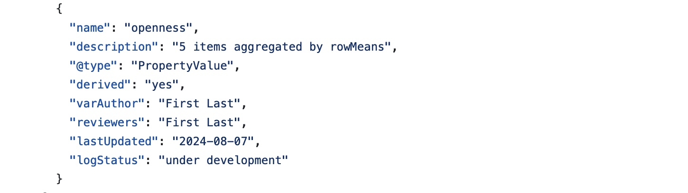
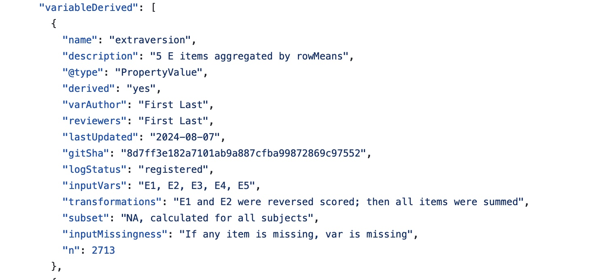

# Example
This is an example of a [**derived data registry**](https://github.com/no-scientist-is-an-island/example-derived-data-registry) that contains a log, code, and data. 

1. The [log](https://github.com/no-scientist-is-an-island/example-derived-data-registry/blob/main/log/derived_data_log.json) is a .json file containing dataset and variable meta-data. Its format adapts some aspects of the Psych-DS specification.

It includes a variable under development:  

And some variables that have been registered:  

2. The [code](https://github.com/no-scientist-is-an-island/example-derived-data-registry/tree/main/code) contains a single .R file for calculating personality derivatives from the Big Five Inventory. When other variables types are registered, their code is uploaded in separate files. 

3. The [data](https://github.com/no-scientist-is-an-island/example-derived-data-registry/tree/main/data) contains a single .csv file containing personality derivatives from the Big Five Inventory and shares the same name as the code. When other variables types are registered, their data ought to be uploaded to in separate files, as well. Take care to ensure that only those with permission to access the data can do so.

#### References
To create this example, we adpated code from the [Psych-DS example BFI dataset](https://github.com/psych-ds/example-datasets). 